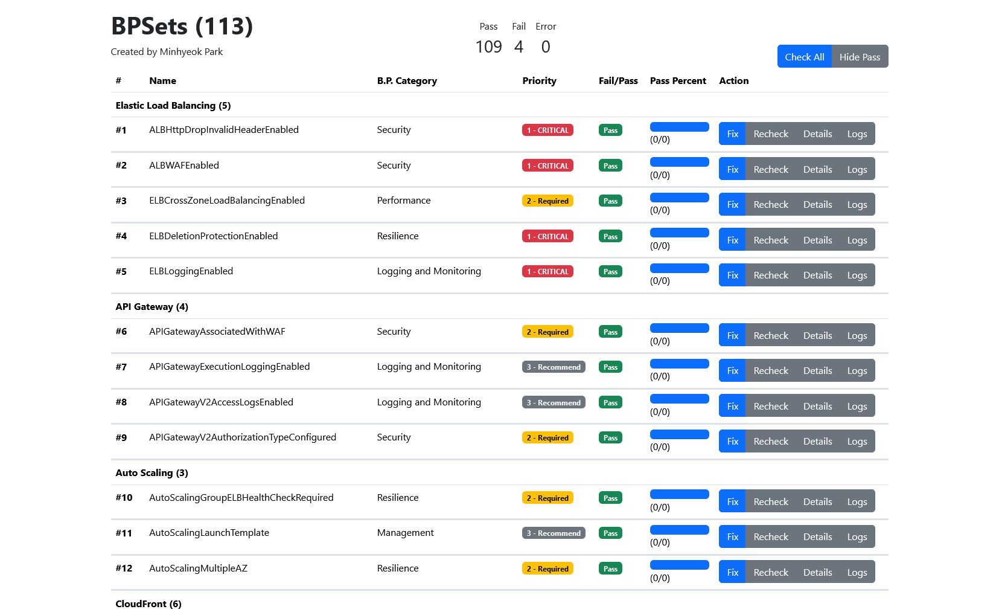
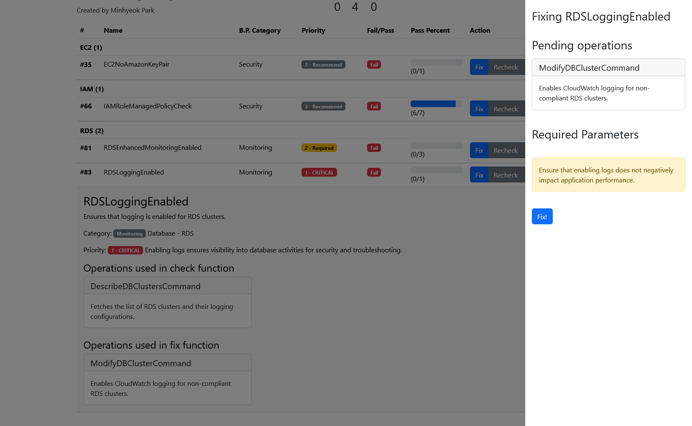

# BPSets
The AWS best practices checker & fixer.
Inspired by AWS config and [skyuecx0630/bp-check](https://github.com/skyuecx0630/bp-check) but improved performance via async jobs and better memoization.

Also provides Web based UI powered by bootstrap!

## Screenshots
| | |
|:-:|:-:|
|  |  |
| BP List | Fixing Non Compliant |

## Features
* Web based UI
* Best Practice Checker
* Non Compliant Resource Fixer
* Categorized & Prioritized BPSet Lists
* [Easy to Implement Best Practices](./src/types.d.ts)

## Implemented BPSets
- [**WAFv2LoggingEnabled**](./src/bpsets/waf/WAFv2LoggingEnabled.ts): Ensures that AWS WAFv2 WebACLs have logging enabled.
- [**WAFv2RuleGroupLoggingEnabled**](./src/bpsets/waf/WAFv2RuleGroupLoggingEnabled.ts): Ensures that AWS WAFv2 Rule Groups have logging enabled.
- [**WAFv2RuleGroupNotEmpty**](./src/bpsets/waf/WAFv2RuleGroupNotEmpty.ts): Ensures WAFv2 Rule Groups are not empty and contain at least one rule.
- [**WAFv2WebACLNotEmpty**](./src/bpsets/waf/WAFv2WebACLNotEmpty.ts): Ensures WAFv2 Web ACLs are not empty and contain at least one rule.
- [**EC2TransitGatewayAutoVPCAttachDisabled**](./src/bpsets/vpc/EC2TransitGatewayAutoVPCAttachDisabled.ts): Ensures that Transit Gateways have Auto VPC Attachments disabled.
- [**RestrictedCommonPorts**](./src/bpsets/vpc/RestrictedCommonPorts.ts): Ensures that common ports (e.g., SSH, HTTP, database ports) are not exposed to the public without proper restrictions.
- [**RestrictedSSH**](./src/bpsets/vpc/RestrictedSSH.ts): Ensures SSH (port 22) is not accessible from 0.0.0.0/0 in security groups.
- [**SubnetAutoAssignPublicIPDisabled**](./src/bpsets/vpc/SubnetAutoAssignPublicIPDisabled.ts): Ensures that subnets do not automatically assign public IPs.
- [**VPCDefaultSecurityGroupClosed**](./src/bpsets/vpc/VPCDefaultSecurityGroupClosed.ts): Ensures that default VPC security groups have no ingress or egress rules.
- [**VPCFlowLogsEnabled**](./src/bpsets/vpc/VPCFlowLogsEnabled.ts): Ensures that VPC Flow Logs are enabled for all VPCs.
- [**VPCNetworkACLUnusedCheck**](./src/bpsets/vpc/VPCNetworkACLUnusedCheck.ts): Ensures that unused network ACLs are identified and removed.
- [**VPCPeeringDNSResolutionCheck**](./src/bpsets/vpc/VPCPeeringDNSResolutionCheck.ts): Ensures that DNS resolution is enabled for all VPC peering connections.
- [**VPCSGOpenOnlyToAuthorizedPorts**](./src/bpsets/vpc/VPCSGOpenOnlyToAuthorizedPorts.ts): Ensures that security group rules do not allow unrestricted access to unauthorized ports.
- [**SNSEncryptedKMS**](./src/bpsets/sns/SNSEncryptedKMS.ts): Ensures that all SNS topics are encrypted with a KMS key.
- [**SNSTopicMessageDeliveryNotificationEnabled**](./src/bpsets/sns/SNSTopicMessageDeliveryNotificationEnabled.ts): Ensures that SNS topics have message delivery notifications enabled.
- [**SecurityHubEnabled**](./src/bpsets/securityhub/SecurityHubEnabled.ts): Ensures that AWS Security Hub is enabled for the AWS account.
- [**SecretsManagerRotationEnabledCheck**](./src/bpsets/secretsmanager/SecretsManagerRotationEnabledCheck.ts): Ensures all Secrets Manager secrets have rotation enabled.
- [**SecretsManagerScheduledRotationSuccessCheck**](./src/bpsets/secretsmanager/SecretsManagerScheduledRotationSuccessCheck.ts): Checks if Secrets Manager secrets have successfully rotated within their scheduled period.
- [**SecretsManagerSecretPeriodicRotation**](./src/bpsets/secretsmanager/SecretsManagerSecretPeriodicRotation.ts): Ensures that Secrets Manager secrets are rotated periodically (every 90 days).
- [**S3AccessPointInVpcOnly**](./src/bpsets/s3/S3AccessPointInVpcOnly.ts): Ensures that all S3 access points are restricted to a VPC.
- [**S3BucketDefaultLockEnabled**](./src/bpsets/s3/S3BucketDefaultLockEnabled.ts): Ensures that all S3 buckets have default object lock configuration enabled.
- [**S3BucketLevelPublicAccessProhibited**](./src/bpsets/s3/S3BucketLevelPublicAccessProhibited.ts): Ensures that S3 buckets have public access blocked at the bucket level.
- [**S3BucketLoggingEnabled**](./src/bpsets/s3/S3BucketLoggingEnabled.ts): Ensures that S3 buckets have logging enabled.
- [**S3BucketSSLRequestsOnly**](./src/bpsets/s3/S3BucketSSLRequestsOnly.ts): Ensures that all S3 bucket requests are made using SSL.
- [**S3BucketVersioningEnabled**](./src/bpsets/s3/S3BucketVersioningEnabled.ts): Ensures that versioning is enabled on all S3 buckets.
- [**S3DefaultEncryptionKMS**](./src/bpsets/s3/S3DefaultEncryptionKMS.ts): Ensures that all S3 buckets have default encryption enabled using AWS KMS.
- [**S3EventNotificationsEnabled**](./src/bpsets/s3/S3EventNotificationsEnabled.ts): Ensures that S3 buckets have event notifications configured.
- [**S3LastBackupRecoveryPointCreated**](./src/bpsets/s3/S3LastBackupRecoveryPointCreated.ts): Ensures that S3 buckets have recent backup recovery points.
- [**S3LifecyclePolicyCheck**](./src/bpsets/s3/S3LifecyclePolicyCheck.ts): Ensures that all S3 buckets have lifecycle policies configured.
- [**AuroraLastBackupRecoveryPointCreated**](./src/bpsets/rds/AuroraLastBackupRecoveryPointCreated.ts): Ensures that Aurora DB clusters have a recovery point created within the last 24 hours.
- [**AuroraMySQLBacktrackingEnabled**](./src/bpsets/rds/AuroraMySQLBacktrackingEnabled.ts): Ensures that backtracking is enabled for Aurora MySQL clusters.
- [**DBInstanceBackupEnabled**](./src/bpsets/rds/DBInstanceBackupEnabled.ts): Ensures that backups are enabled for RDS instances.
- [**RDSClusterAutoMinorVersionUpgradeEnabled**](./src/bpsets/rds/RDSClusterAutoMinorVersionUpgradeEnabled.ts): Ensures Auto Minor Version Upgrade is enabled for RDS clusters.
- [**RDSClusterDefaultAdminCheck**](./src/bpsets/rds/RDSClusterDefaultAdminCheck.ts): Ensures that RDS clusters do not use default administrative usernames (e.g., admin, postgres).
- [**RDSClusterDeletionProtectionEnabled**](./src/bpsets/rds/RDSClusterDeletionProtectionEnabled.ts): Ensures that RDS clusters have deletion protection enabled.
- [**RDSClusterEncryptedAtRest**](./src/bpsets/rds/RDSClusterEncryptedAtRest.ts): Ensures that RDS clusters have encryption at rest enabled.
- [**RDSClusterIAMAuthenticationEnabled**](./src/bpsets/rds/RDSClusterIAMAuthenticationEnabled.ts): Ensures that IAM Database Authentication is enabled for RDS clusters.
- [**RDSClusterMultiAZEnabled**](./src/bpsets/rds/RDSClusterMultiAZEnabled.ts): Ensures that RDS clusters are deployed across multiple availability zones.
- [**RDSDBSecurityGroupNotAllowed**](./src/bpsets/rds/RDSDBSecurityGroupNotAllowed.ts): Ensures RDS clusters are not associated with the default security group.
- [**RDSEnhancedMonitoringEnabled**](./src/bpsets/rds/RDSEnhancedMonitoringEnabled.ts): Ensures that Enhanced Monitoring is enabled for RDS instances.
- [**RDSInstancePublicAccessCheck**](./src/bpsets/rds/RDSInstancePublicAccessCheck.ts): Ensures RDS instances are not publicly accessible.
- [**RDSLoggingEnabled**](./src/bpsets/rds/RDSLoggingEnabled.ts): Ensures that logging is enabled for RDS clusters.
- [**RDSSnapshotEncrypted**](./src/bpsets/rds/RDSSnapshotEncrypted.ts): Ensures RDS cluster snapshots are encrypted.
- [**LambdaDLQCheck**](./src/bpsets/lambda/LambdaDLQCheck.ts): Ensures that Lambda functions have a configured Dead Letter Queue (DLQ).
- [**LambdaFunctionPublicAccessProhibited**](./src/bpsets/lambda/LambdaFunctionPublicAccessProhibited.ts): Ensures that Lambda functions do not allow public access via their resource-based policies.
- [**LambdaFunctionSettingsCheck**](./src/bpsets/lambda/LambdaFunctionSettingsCheck.ts): Ensures Lambda functions have non-default timeout and memory size configurations.
- [**LambdaInsideVPC**](./src/bpsets/lambda/LambdaInsideVPC.ts): Ensures Lambda functions are configured to run inside a VPC.
- [**IAMPolicyNoStatementsWithAdminAccess**](./src/bpsets/iam/IAMPolicyNoStatementsWithAdminAccess.ts): Ensures IAM policies do not contain statements granting full administrative access.
- [**IAMPolicyNoStatementsWithFullAccess**](./src/bpsets/iam/IAMPolicyNoStatementsWithFullAccess.ts): Ensures IAM policies do not have statements granting full access.
- [**IAMRoleManagedPolicyCheck**](./src/bpsets/iam/IAMRoleManagedPolicyCheck.ts): Checks whether managed IAM policies are attached to any entities (roles, users, or groups).
- [**ElastiCacheAutoMinorVersionUpgradeCheck**](./src/bpsets/elasticache/ElastiCacheAutoMinorVersionUpgradeCheck.ts): Ensures that ElastiCache clusters have auto minor version upgrade enabled.
- [**ElastiCacheRedisClusterAutomaticBackupCheck**](./src/bpsets/elasticache/ElastiCacheRedisClusterAutomaticBackupCheck.ts): Ensures that Redis clusters in ElastiCache have automatic backups enabled.
- [**ElastiCacheReplGrpAutoFailoverEnabled**](./src/bpsets/elasticache/ElastiCacheReplGrpAutoFailoverEnabled.ts): Ensures that automatic failover is enabled for ElastiCache replication groups.
- [**ElastiCacheReplGrpEncryptedAtRest**](./src/bpsets/elasticache/ElastiCacheReplGrpEncryptedAtRest.ts): Ensures that ElastiCache replication groups are encrypted at rest.
- [**ElastiCacheReplGrpEncryptedInTransit**](./src/bpsets/elasticache/ElastiCacheReplGrpEncryptedInTransit.ts): Ensures that ElastiCache replication groups have in-transit encryption enabled.
- [**ElastiCacheSubnetGroupCheck**](./src/bpsets/elasticache/ElastiCacheSubnetGroupCheck.ts): Ensures ElastiCache clusters are not using the default subnet group.
- [**EKSClusterLoggingEnabled**](./src/bpsets/eks/EKSClusterLoggingEnabled.ts): Ensures that all EKS clusters have full logging enabled.
- [**EKSClusterSecretsEncrypted**](./src/bpsets/eks/EKSClusterSecretsEncrypted.ts): Ensures that all EKS clusters have secrets encrypted with a KMS key.
- [**EKSEndpointNoPublicAccess**](./src/bpsets/eks/EKSEndpointNoPublicAccess.ts): Ensures EKS cluster endpoint does not have public access enabled.
- [**EFSAccessPointEnforceRootDirectory**](./src/bpsets/efs/EFSAccessPointEnforceRootDirectory.ts): Ensures that EFS Access Points enforce a specific root directory.
- [**EFSAccessPointEnforceUserIdentity**](./src/bpsets/efs/EFSAccessPointEnforceUserIdentity.ts): Ensures that EFS Access Points enforce a specific PosixUser identity.
- [**EFSAutomaticBackupsEnabled**](./src/bpsets/efs/EFSAutomaticBackupsEnabled.ts): Ensures that EFS file systems have automatic backups enabled.
- [**EFSEncryptedCheck**](./src/bpsets/efs/EFSEncryptedCheck.ts): Ensures that all EFS file systems are encrypted.
- [**EFSMountTargetPublicAccessible**](./src/bpsets/efs/EFSMountTargetPublicAccessible.ts): Checks if EFS mount targets are publicly accessible.
- [**ECSAwsVpcNetworkingEnabled**](./src/bpsets/ecs/ECSAwsVpcNetworkingEnabled.ts): Ensures that ECS task definitions are configured to use the awsvpc network mode.
- [**ECSContainerInsightsEnabled**](./src/bpsets/ecs/ECSContainerInsightsEnabled.ts): Ensures that ECS clusters have Container Insights enabled.
- [**ECSContainersNonPrivileged**](./src/bpsets/ecs/ECSContainersNonPrivileged.ts): Ensures that containers in ECS task definitions are not running in privileged mode.
- [**ECSContainersReadonlyAccess**](./src/bpsets/ecs/ECSContainersReadonlyAccess.ts): Ensures that containers in ECS task definitions have readonly root filesystems enabled.
- [**ECSFargateLatestPlatformVersion**](./src/bpsets/ecs/ECSFargateLatestPlatformVersion.ts): Ensures ECS Fargate services are using the latest platform version.
- [**ECSTaskDefinitionLogConfiguration**](./src/bpsets/ecs/ECSTaskDefinitionLogConfiguration.ts): Ensures that ECS task definitions have log configuration enabled.
- [**ECSTaskDefinitionMemoryHardLimit**](./src/bpsets/ecs/ECSTaskDefinitionMemoryHardLimit.ts): Ensures all containers in ECS task definitions have a memory hard limit set.
- [**ECSTaskDefinitionNonRootUser**](./src/bpsets/ecs/ECSTaskDefinitionNonRootUser.ts): Ensures all ECS containers in task definitions run as non-root users.
- [**ECRKmsEncryption1**](./src/bpsets/ecr/ECRKmsEncryption1.ts): Ensures ECR repositories are encrypted using AWS KMS.
- [**ECRPrivateImageScanningEnabled**](./src/bpsets/ecr/ECRPrivateImageScanningEnabled.ts): Ensures that image scanning on push is enabled for private ECR repositories.
- [**ECRPrivateLifecyclePolicyConfigured**](./src/bpsets/ecr/ECRPrivateLifecyclePolicyConfigured.ts): Ensures that private ECR repositories have lifecycle policies configured.
- [**ECRPrivateTagImmutabilityEnabled**](./src/bpsets/ecr/ECRPrivateTagImmutabilityEnabled.ts): Ensures that private ECR repositories have tag immutability enabled.
- [**EC2EbsEncryptionByDefault**](./src/bpsets/ec2/EC2EbsEncryptionByDefault.ts): Ensures that EBS encryption is enabled by default for all volumes in the AWS account.
- [**EC2Imdsv2Check**](./src/bpsets/ec2/EC2Imdsv2Check.ts): Ensures that EC2 instances enforce the use of IMDSv2 for enhanced metadata security.
- [**EC2InstanceDetailedMonitoringEnabled**](./src/bpsets/ec2/EC2InstanceDetailedMonitoringEnabled.ts): Ensures that EC2 instances have detailed monitoring enabled.
- [**EC2InstanceManagedBySystemsManager**](./src/bpsets/ec2/EC2InstanceManagedBySystemsManager.ts): Ensures that EC2 instances are managed by AWS Systems Manager.
- [**EC2InstanceProfileAttached**](./src/bpsets/ec2/EC2InstanceProfileAttached.ts): Ensures that all EC2 instances have an IAM instance profile attached.
- [**EC2NoAmazonKeyPair**](./src/bpsets/ec2/EC2NoAmazonKeyPair.ts): Ensures that EC2 instances are not using an Amazon Key Pair.
- [**EC2StoppedInstance**](./src/bpsets/ec2/EC2StoppedInstance.ts): Ensures that stopped EC2 instances are identified and terminated if necessary.
- [**EC2TokenHopLimitCheck**](./src/bpsets/ec2/EC2TokenHopLimitCheck.ts): Ensures that EC2 instances have a Metadata Options HttpPutResponseHopLimit of 1.
- [**DynamoDBAutoscalingEnabled**](./src/bpsets/dynamodb/DynamoDBAutoscalingEnabled.ts): Ensures DynamoDB tables have autoscaling enabled for both read and write capacity.
- [**DynamoDBLastBackupRecoveryPointCreated**](./src/bpsets/dynamodb/DynamoDBLastBackupRecoveryPointCreated.ts): Ensures that DynamoDB tables have a recent recovery point within the last 24 hours.
- [**DynamoDBPITREnabled**](./src/bpsets/dynamodb/DynamoDBPITREnabled.ts): Ensures that Point-In-Time Recovery (PITR) is enabled for DynamoDB tables.
- [**DynamoDBTableDeletionProtectionEnabled**](./src/bpsets/dynamodb/DynamoDBTableDeletionProtectionEnabled.ts): Ensures that deletion protection is enabled for DynamoDB tables.
- [**DynamoDBTableEncryptedKMS**](./src/bpsets/dynamodb/DynamoDBTableEncryptedKMS.ts): Ensures that DynamoDB tables are encrypted with AWS KMS.
- [**DynamoDBTableEncryptionEnabled**](./src/bpsets/dynamodb/DynamoDBTableEncryptionEnabled.ts): Ensures that DynamoDB tables have server-side encryption enabled.
- [**CodeBuildProjectEnvironmentPrivilegedCheck**](./src/bpsets/codeseries/CodeBuildProjectEnvironmentPrivilegedCheck.ts): Ensures that AWS CodeBuild projects are not using privileged mode for their environment.
- [**CodeBuildProjectLoggingEnabled**](./src/bpsets/codeseries/CodeBuildProjectLoggingEnabled.ts): Ensures that logging is enabled for AWS CodeBuild projects.
- [**CodeDeployAutoRollbackMonitorEnabled**](./src/bpsets/codeseries/CodeDeployAutoRollbackMonitorEnabled.ts): Ensures that auto-rollback and alarm monitoring are enabled for CodeDeploy deployment groups.
- [**CWLogGroupRetentionPeriodCheck**](./src/bpsets/cloudwatch/CWLogGroupRetentionPeriodCheck.ts): Ensures all CloudWatch log groups have a retention period set.
- [**CloudWatchAlarmSettingsCheck**](./src/bpsets/cloudwatch/CloudWatchAlarmSettingsCheck.ts): Ensures that CloudWatch alarms have the required settings configured.
- [**CloudFrontAccessLogsEnabled**](./src/bpsets/cloudfront/CloudFrontAccessLogsEnabled.ts): Ensures that access logging is enabled for CloudFront distributions.
- [**CloudFrontAssociatedWithWAF**](./src/bpsets/cloudfront/CloudFrontAssociatedWithWAF.ts): Ensures that CloudFront distributions are associated with a WAF.
- [**CloudFrontDefaultRootObjectConfigured**](./src/bpsets/cloudfront/CloudFrontDefaultRootObjectConfigured.ts): Ensures that CloudFront distributions have a default root object configured.
- [**CloudFrontNoDeprecatedSSLProtocols**](./src/bpsets/cloudfront/CloudFrontNoDeprecatedSSLProtocols.ts): Ensures that CloudFront distributions do not use deprecated SSL protocols like SSLv3.
- [**CloudFrontS3OriginAccessControlEnabled**](./src/bpsets/cloudfront/CloudFrontS3OriginAccessControlEnabled.ts): Ensures that CloudFront distributions with S3 origins have Origin Access Control (OAC) enabled.
- [**CloudFrontViewerPolicyHTTPS**](./src/bpsets/cloudfront/CloudFrontViewerPolicyHTTPS.ts): Ensures that CloudFront distributions enforce HTTPS for viewer requests.
- [**AutoScalingGroupELBHealthCheckRequired**](./src/bpsets/asg/AutoScalingGroupELBHealthCheckRequired.ts): Ensures that Auto Scaling groups with ELB or Target Groups use ELB health checks.
- [**AutoScalingLaunchTemplate**](./src/bpsets/asg/AutoScalingLaunchTemplate.ts): Ensures that Auto Scaling groups use a launch template instead of a launch configuration.
- [**AutoScalingMultipleAZ**](./src/bpsets/asg/AutoScalingMultipleAZ.ts): Ensures that Auto Scaling groups are configured to use multiple Availability Zones.
- [**APIGatewayAssociatedWithWAF**](./src/bpsets/apigw/APIGatewayAssociatedWithWAF.ts): Ensures that API Gateway stages are associated with WAF.
- [**APIGatewayExecutionLoggingEnabled**](./src/bpsets/apigw/APIGatewayExecutionLoggingEnabled.ts): Ensures that execution logging is enabled for API Gateway stages.
- [**APIGatewayV2AccessLogsEnabled**](./src/bpsets/apigw/APIGatewayV2AccessLogsEnabled.ts): Ensures that access logging is enabled for API Gateway v2 stages.
- [**APIGatewayV2AuthorizationTypeConfigured**](./src/bpsets/apigw/APIGatewayV2AuthorizationTypeConfigured.ts): Ensures that authorization type is configured for API Gateway v2 routes.
- [**ALBHttpDropInvalidHeaderEnabled**](./src/bpsets/alb/ALBHttpDropInvalidHeaderEnabled.ts): Ensures that ALBs have invalid HTTP headers dropped.
- [**ALBWAFEnabled**](./src/bpsets/alb/ALBWAFEnabled.ts): Ensures that WAF is associated with ALBs.
- [**ELBCrossZoneLoadBalancingEnabled**](./src/bpsets/alb/ELBCrossZoneLoadBalancingEnabled.ts): Ensures that cross-zone load balancing is enabled for Elastic Load Balancers.
- [**ELBDeletionProtectionEnabled**](./src/bpsets/alb/ELBDeletionProtectionEnabled.ts): Ensures that deletion protection is enabled for Elastic Load Balancers.
- [**ELBLoggingEnabled**](./src/bpsets/alb/ELBLoggingEnabled.ts): Ensures that access logging is enabled for Elastic Load Balancers.
